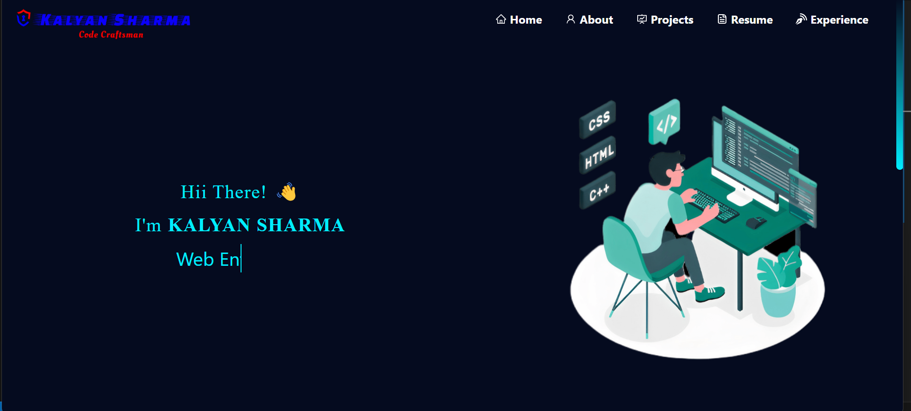
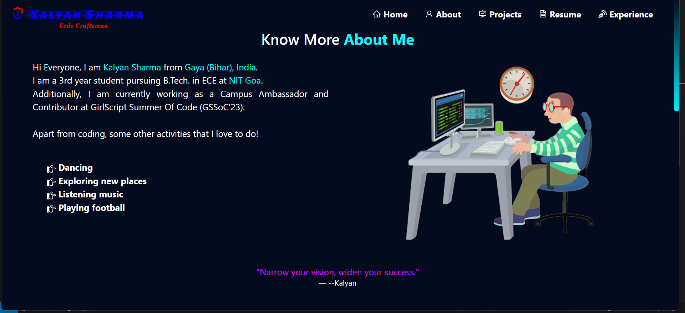
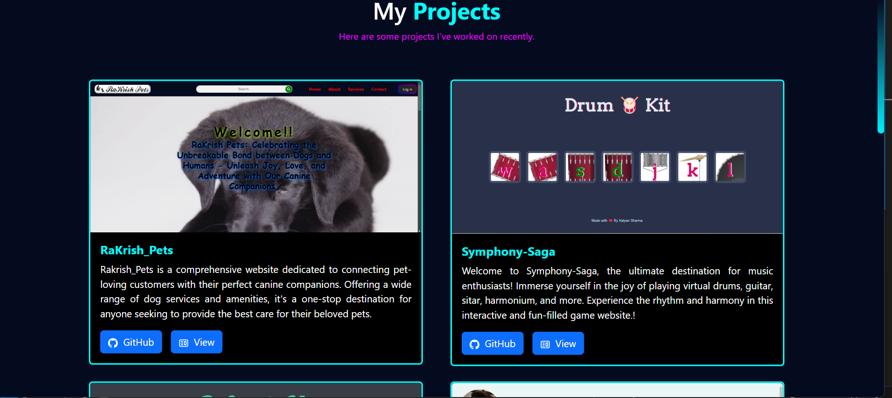
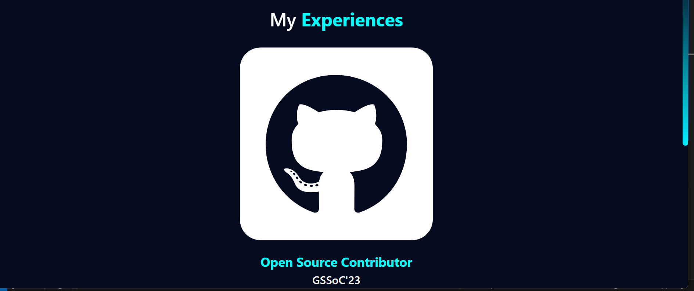
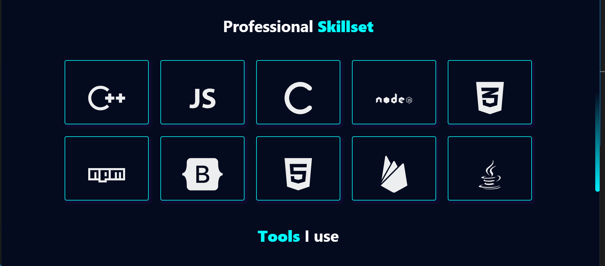

# Kalyan - 21ECE1013

## Tech Stack

This project uses the following technologies:

- HTML
- CSS
- Bootstrap
- JavaScript

## Challenges Faced

During the development of this project, the following challenges were faced:

- Choosing the right font colors, styles, stunning designs
- Adding animations to the websites
- responsiveness of the website
- menu bar responsiveness and animations

## Installation

To run this project locally, follow these steps:

1.install live preview/Live Preview in VS code to preview the file

## Preview of Kalyan-Porfolio

Here's a short preview of how my portfolio website look like:

